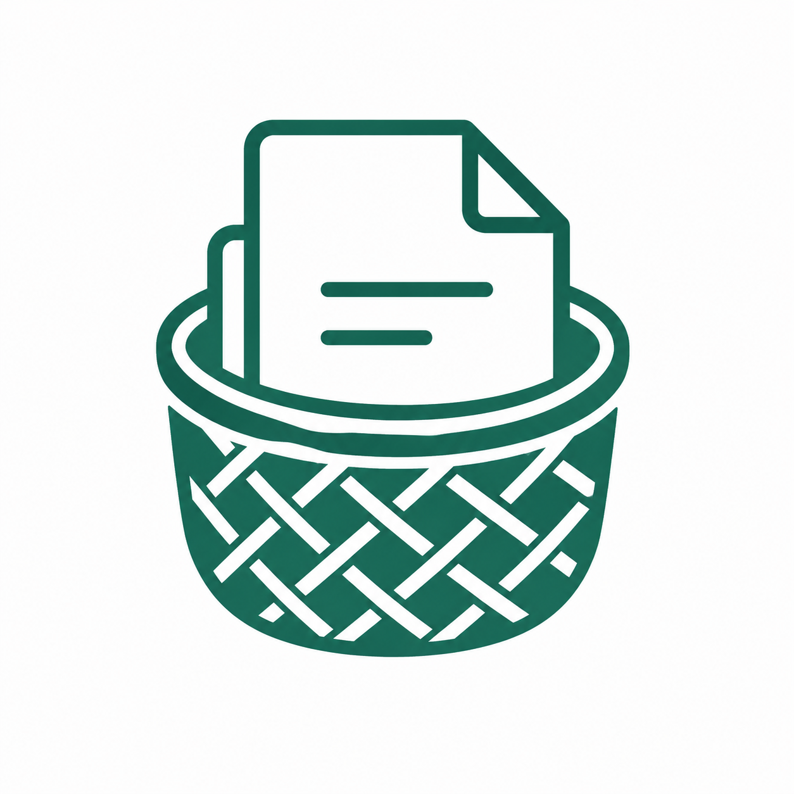

<p align="center">
  <a href="https://dokodocs.com">
    
  </a>
</p>

<h3 align="center">Own Your Documents.</h3>

<p align="center">
  The official website for <b>DokoDocs</b> — an open-source, privacy-first document scanner<br>
  and PDF toolkit for Android & iOS. Built with care in Nepal 🇳🇵
</p>

<p align="center">
  <a href="https://dokodocs.com"></a>
  <a href="https://github.com/dokodocs/app"></a>
  <a href="https://www.apache.org/licenses/LICENSE-2.0"></a>
</p>

<p align="center">
  <a href="https://dokodocs.com">🌐 Website</a> ·
  <a href="https://github.com/dokodocs/app">📱 App Repository</a> ·
  <a href="https://github.com/dokodocs/app/releases">⬇️ Download APK</a> ·
  <a href="#-about-the-app">Features</a> ·
  <a href="#-local-development">Develop</a>
</p>

---

## 📄 About the App

[**DokoDocs**](https://github.com/dokodocs/app) scans, enhances, and exports documents to PDF — with your files staying **on your device by default**. No forced cloud upload, no mandatory account, zero Google Play Services dependency. When you do want to sync, *you* choose the destination: your own server, your own cloud, or nowhere at all.

| | Feature |
|---|---|
| 📷 | **Live edge detection** with tap-to-target object selection |
| ✂️ | Automatic crop & perspective correction, plus a manual editor with draggable corners |
| ⚡ | One-step **capture-to-PDF** workflow |
| 🎨 | Enhancement modes: Auto, Magic Color, Professional, Receipt, B&W Text |
| 📑 | Batch scanning with version history |
| 🖼️ | Gallery import with HEIC support |
| 🗓️ | Dual-calendar support (AD & BS dates) |
| 🔒 | **Local-first storage** — optional sync only where you decide |

**Tech:** Flutter 3.x · Dart · fully native OpenCV vision pipeline · Android 7.0+ / iOS 13.0+

➡️ Get the app: [**github.com/dokodocs/app**](https://github.com/dokodocs/app) — APKs on the [Releases page](https://github.com/dokodocs/app/releases); iOS App Store release in progress.

---

## 🌐 This Repository

This repo holds the marketing site served at [**dokodocs.com**](https://dokodocs.com) — plain HTML/CSS/JS, no build step, no framework.

```
index.html            Home page
blog/                 Blog posts
privacy.html          Privacy policy
terms.html            Terms of use
404.html              Not-found page
css/styles.css        Brand stylesheet (see docs/BrandGuidelines.md)
js/main.js            Nav toggle, scroll-reveal, active-link highlighting
assets/               Logo, icons, illustrations, store badges
docs/                 Source-of-truth brand & product docs (not deployed)
robots.txt, sitemap.xml   SEO
```

## 🛠️ Local Development

No tooling required — it's static HTML. Serve the folder with any static file server:

```bash
python -m http.server 8080
# then open http://localhost:8080
```

or use the VS Code **Live Server** extension.

## 🚀 Deploying

**GitHub Pages** — Repo → *Settings → Pages* → set the source branch/folder. For a custom domain, add a `CNAME` file containing `dokodocs.com` and point DNS at GitHub Pages.

**Cloudflare Pages** — connect the repo, leave the build command blank, output directory `/`, deploy.

## 🤝 Community

- 🌐 Website: [dokodocs.com](https://dokodocs.com)
- 💻 App source: [github.com/dokodocs/app](https://github.com/dokodocs/app)
- 🐦 X / Twitter: [@dokodocs_app](https://x.com/dokodocs_app)
- ▶️ YouTube: [@dokodocs](https://www.youtube.com/@dokodocs)
- 📸 Instagram: [@dokodocs](https://instagram.com/dokodocs)
- 💼 LinkedIn: [dokodocs](https://linkedin.com/company/dokodocs)

## 📜 License

Apache License 2.0, matching the main [DokoDocs app](https://github.com/dokodocs/app) — see [LICENSE](https://www.apache.org/licenses/LICENSE-2.0).

---

<p align="center">Made with care in Nepal 🇳🇵</p>
